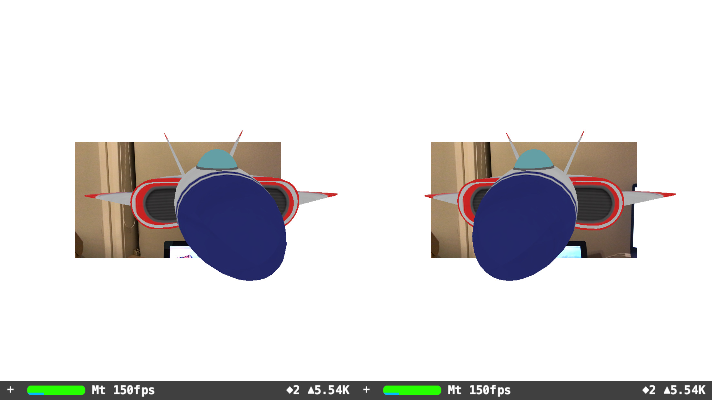

# ARKit Headset View

Make your ARKit experiment compatible with mobile VR/AR headsets*. An example setup using SceneKit. Useful for playing with head-worn Mixed Reality, Augmented Reality, or Virtual Reality with headtracking.

_(This template was built off my earlier ["iOS Stereoscopic ARKit Template"](https://github.com/hanleyweng/iOS-Stereoscopic-ARKit-Template) )_


Language: Swift

Content Technology: SceneKit

Written in (Updated): Xcode 9.3 beta (9Q98q)

Tested on (Updated): iPhone 7+ running iOS 11.3 beta 1 (15E5167f)

## Footnotes

\* Mobile Headset needs to have an opening for the iPhone's camera (i.e. a headset that supports Mixed Reality or Augmented Reality). You could also use a Google Cardboard with a hole cut out.

Notes:

- At the beginning of the code, there's easy access to variables: interpupilary-distance, background color, and the eye's field-of-view (which must be changed alongside the cameraImageScale).

- METAL should ideally be used for optimal performance in future. (We're currently using SceneKit here.)

- This code was written as a proof of concept. Production-level applications should ideally use more accurate calculations (e.g. for camera.projectionMatrix, and FOV). 

- The framerate displayed by SceneViews is actually 3x it's actual rate (as we're actually rendering the same scene 3 times).

- This is experimental code running on (iOS11) beta software that is likely to change.


## Steps Taken

_(P.S. If needed, the [commits](https://github.com/hanleyweng/iOS-ARKit-Headset-View/commits/master) show more granular steps.)_

### 1. Add a left-eye and right-eye SceneView

Same steps as here: ["iOS Stereoscopic ARKit Template"](https://github.com/hanleyweng/iOS-Stereoscopic-ARKit-Template). Except, now we have 3 SceneViews (the original, the left-eye, and the right-eye).

### 2. Adjust PointOfView according to a FieldOfView value

In updateFrame:


```
let eyeFOV = 60 // (To be Adjusted later on)

let eyeCamera : SCNCamera = SCNCamera()
eyeCamera.zNear = 0.001
eyeCamera.fieldOfView = CGFloat(eyeFOV)

let pointOfView : SCNNode = SCNNode()
pointOfView.transform = (sceneViewRaw.pointOfView?.transform)!
pointOfView.scale = (sceneViewRaw.pointOfView?.scale)!
pointOfView.camera = eyeCamera
```

### 3. Re-Render Camera Image

In Storyboards, create two UIImageViews, behind the ARSCNViews. These represent the camera feed of the left and right eye.

Clear the camera image.

In updateFrame:

```
sceneViewLeft.scene.background.contents = UIColor.clear // This sets a transparent scene bg for all sceneViews - as they're all rendering the same scene.
```

Re-Render the Camera Image - adjusting for scale and orientation

```
let cameraImageScale = 3.478 // (To be Adjusted later on)

// Read Camera-Image
let pixelBuffer : CVPixelBuffer? = sceneViewRaw.session.currentFrame?.capturedImage
if pixelBuffer == nil { return }
let ciimage = CIImage(cvPixelBuffer: pixelBuffer!)

// Convert ciimage to cgimage, so uiimage can affect its orientation
let context = CIContext(options: nil)
let cgimage = context.createCGImage(ciimage, from: ciimage.extent)

// Determine Camera-Image Orientation
let imageOrientation : UIImageOrientation = (UIApplication.shared.statusBarOrientation == UIInterfaceOrientation.landscapeLeft) ? UIImageOrientation.down : UIImageOrientation.up

// Display Camera-Image
let uiimage = UIImage(cgImage: cgimage!, scale: scale_custom, orientation: imageOrientation)
self.imageViewLeft.image = uiimage
self.imageViewRight.image = uiimage

```

### 4. Determine appropriate cameraImageScale for different eye-fieldOfViews.

This was done with some maths, but mainly lots of guessing. He's some values that I've estimated based on the iPhone7+'s size.

```
//    let eyeFOV = 38.5; let cameraImageScale = 1.739; // (FOV: 38.5 ± 2.0) Brute-force estimate based on iPhone7+
//    let eyeFOV = 60; let cameraImageScale = 3.478; // Calculation based on iPhone7+
//    let eyeFOV = 90; let cameraImageScale = 6; // (Scale: 6 ± 1.0) Very Rough Guestimate.
//    let eyeFOV = 120; let cameraImageScale = 8.756; // Rough Guestimate.
```

### Done!

([MIT License](https://choosealicense.com/licenses/mit/)) – the most open license I could find. Feel free use in absolutely whatever way you like. Have fun! 😁


